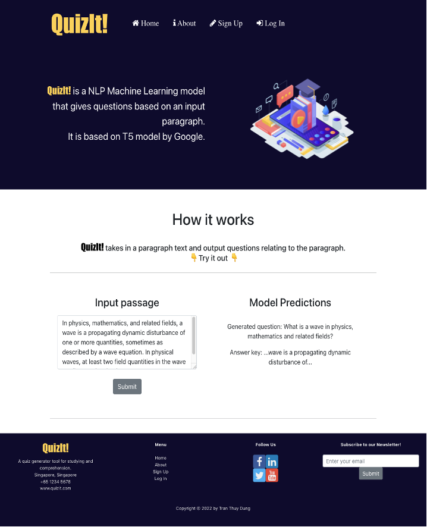

# FINAL YEAR PROJECT - NTU EEE
* By [Tran Thuy Dung][linkedin-url]
* Supervisor: [Assoc. Prof. Andy Khong](https://personal.ntu.edu.sg/andykhong/) :D

## Project Title: Automatic Question Generation with Natural Language Processing
<br/>

<div id="top"></div>


[![LinkedIn][linkedin-shield]][linkedin-url]

<br />
<div align="center">

  <h3 align="center">NTU EEE FINAL YEAR PROJECT</h3>
  <h3 align="center">Automatic Question Generation with Natural Language Processing</h3>

  <p align="center">
    by Tran Thuy Dung
  </p>
</div>


<!-- TABLE OF CONTENTS -->
<details>
  <summary>Table of Contents</summary>
  <ol>
    <li>
      <a href="#about-the-project">About The Project</a>
      <ul>
        <li><a href="#built-with">Built With</a></li>
      </ul>
    </li>
    <li>
      <a href="#getting-started">Getting Started</a>
      <ul>
        <li><a href="#installation">Installation</a></li>
      </ul>
    </li>
    <li><a href="#usage">Usage</a></li>
    <li><a href="#contact">Contact</a></li>
    <li><a href="#acknowledgments">Acknowledgments</a></li>
  </ol>
</details>


<!-- ABOUT THE PROJECT -->
## About The Project


This project uses transfer learning to train a T5 model for Automatic Question Generation (AQG). A React Web Application with a SQLite backend is also created to demo the model!

Main project objectives:
* Generate a model pipeline to train T5 for AQG with Pytorch and SQuAD data
* Frontend web application with React
* Backend with FastAPI, SQLAlchemy and Pydantic

<p align="right">(<a href="#top">back to top</a>)</p>


### Built With

Major frameworks/libraries used:
* [React.js](https://reactjs.org/)
* [Bootstrap](https://getbootstrap.com)
* [JQuery](https://jquery.com)
* [FastAPI](https://fastapi.tiangolo.com/)
* [Pytorch](https://pytorch.org/)
* [SQLalchemy](https://www.sqlalchemy.org/)
* [Pydantic](https://pydantic-docs.helpmanual.io/)

<p align="right">(<a href="#top">back to top</a>)</p>


<!-- GETTING STARTED -->
## Getting Started

Below are the steps to run the scripts. There are 3 main folders:
* `/model`: contains the pipeline for the model, which can be run on a terminal
* `/fyp-app`: frontend scripts for the React app
* `/backend`: backend scripts containing the API and the database utils.

### Installation
Clone this repo
   ```sh
   git clone git@github.com:yoongtr/fyp-scripts.git
   ```

Create a conda environment and install necessary libraries. Navigate to the root folder and run:
* conda/pip environment
  ```sh
  conda create -yn aqg-app python=3.7 # create a new environment
  conda activate aqg-app
  conda install --file requirements.txt
  pip install -r requirements.txt
  ```
The `requirements.txt` file stores the libraries and corresponding versions for the repo.
<br/>
To run the app:
* To run the backend: navigate to `/backend`
  ```sh
  cd backend
  uvicorn main:app --reload # uvicorn watches changes and reload the app when neccessary
  ```
* After backend is inititalised, navigate to frontend folder to run the frontend app:
  ```sh
  cd ../fyp-app
  npm install # install neccessary npm packages
  npm start # start the web server
  ```
The frontend runs at http://localhost:3000/home while the backend is at http://0.0.0.0:8000/docs#. Open these links in the browser. The app should work fine with an interface like below:


<!-- USAGE EXAMPLES -->
## Usage

### Model pipeline

Training model or inference from terminal:
* [SQuAD v2.0](https://rajpurkar.github.io/SQuAD-explorer/) is used as training data. The context and answer are treated as input, and the question as output.
* During training, the answer is given. However for inference, only the context is given and an answer is extracted from the context by T5 for summarisation.
* Training pipeline:

* Inference pipeline:

* Navigate to `/model`
* To create JSON data from SQuAD-like format that can be read by the pipeline:
```sh
    python create_eval_data.py # change the file names and paths accordingly
```
* To train the model. The trained model is saved as .ckpt file.
```sh
    python pipeline.py train path-to-processed-json-data checkpoints best-checkpoint t5-base epochs-no batch-size learning-rate
```
for example
```sh
    python pipeline.py train ../SQuAD-2.0/train-v2.0.json checkpoints best-checkpoint t5-base 10 4 0.0001
```
* Inference: infer-with-file parses a txt file, infer-with-ans requires answer input, and infer-without-ans does not require answer input.
```sh
python pipeline.py infer-without-ans t5-base 20220113/best-checkpoint.ckpt # Change path to ckpt file accordingly
```
* For evaluation, there are two types of dev sets for inference - one is the original dev set from SQuAD 2.0 and the other one is the Xinya Du's extracted SQuAD. I already generated the two files as `squad_for_eval.json` and `squad_du_for_eval.json` respectively.
```sh
    python pipeline.py train path-to-processed-json-data checkpoints best-checkpoint t5-base epochs-no batch-size learning-rate
```


### Quiz Generation Web App

* The full framework for the webapp is as below


<p align="right">(<a href="#top">back to top</a>)</p>

* Once the app runs, you should see a home page like this where a paragraph can be submitted and a question + answer key is generated:

<br/>

* Clicking into "Sign Up" or "Log In" pages allows you to see more functions at the homepage. Texts can be submitted to create a quiz.


<br/>

* Going into My Account allows you to see the user information, a leaderboard and past quizzes.


<!-- Model performance -->
## Model performance
* I used [Du's SQuAD dataset](https://github.com/tomhosking/squad-du-split) to evaluate my model and metric scripts from https://github.com/tuetschek/e2e-metrics.
* Below is a comparison between my model and other models (other models scores are from [Lopez et al.'s paper](https://arxiv.org/abs/2005.01107))
Colons can be used to align columns.

| Tables                                    | Answer Provided?  | BLEU-4   | METEOR   | ROUGE_L  |
| ----------------------------------------- |------------------:| --------:| --------:| --------:|
| [Du et al. (2017)][du-2017]               | No                | 12.28    |    16.62 |    39.75 |
| [Du and Cardie (2018)][du-2018]           | Yes               | 15.16    |    19.12 |      -   |
| [Zhao et al. (2018)][zhao-2018]           | No                |   4.8    |    12.52 |    30.11 |
| [Zhao et al. (2018)][zhao-2018]           | Yes               | 16.38    |    20.25 |    44.48 |
| [Dong et al. (2019)][dong-2019]           | Yes               | 22.12    |    25.06 |    51.07 |
| [Lopez et al. (2021)][lopez-2021]         | No                |  8.26    |    21.2  |    44.38 |
| My model (T5 summarization +AQG)          | No                | 16.37    |    20.4  |    41.50 |

<!-- CONTACT -->
## Contact

Yoong (Thuy Dung) - thuydungtran.98@gmail.com - thuydung001@e.ntu.edu.sg

Project Link: [https://github.com/yoongtr/fyp-scripts](https://github.com/yoongtr/fyp-scripts)

<p align="right">(<a href="#top">back to top</a>)</p>


<!-- ACKNOWLEDGMENTS -->
## Acknowledgments

Relevant papers

* [Attention is all you need: Proceedings of the 31st International Conference on Neural Information Processing Systems][vaswani]
* [Learning to ask: Neural question generation for reading comprehension][du-2017]
* [Harvesting paragraph-level question-answer pairs from Wikipedia][du-2018]
* [Paragraph-level neural question generation with Maxout pointer and gated self-attention networks][zhao-2018]
* [Unified language model pre-training for natural language understanding and generation][dong-2019]
* [Simplifying paragraph-level question generation via transformer language models][lopez-2021]

<p align="right">(<a href="#top">back to top</a>)</p>


<!-- MARKDOWN LINKS & IMAGES -->
<!-- https://www.markdownguide.org/basic-syntax/#reference-style-links -->

[linkedin-shield]: https://img.shields.io/badge/-LinkedIn-black.svg?style=for-the-badge&logo=linkedin&colorB=555
[linkedin-url]: https://www.linkedin.com/in/dungtran-yoong/
[product-screenshot]: images/screenshot.png
[du-2017]: https://arxiv.org/abs/1705.00106
[du-2018]: https://arxiv.org/abs/1805.05942
[zhao-2018]: https://aclanthology.org/D18-1424
[dong-2019]: https://arxiv.org/abs/1905.03197
[lopez-2021]: https://arxiv.org/abs/2005.01107
[vaswani]: https://dl.acm.org/doi/10.5555/3295222.3295349